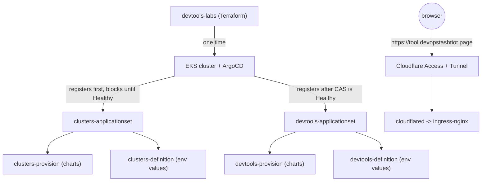

# devtools-labs

Terraform + Terragrunt infrastructure for a self-hosted devtools platform —
Jira, Bitbucket, Confluence, Artifactory, ArgoCD, Xray, Woodpecker, and more
— running on Kubernetes (EKS) and exposed to the internet through Cloudflare
Tunnel + Access. It is the **only one of five sibling repos that runs real
infrastructure code**: from the moment ArgoCD comes up inside the cluster,
every cluster-infra tool and every devtool is deployed and kept in sync by
ArgoCD itself, via two sibling `*-provision`/`*-definition` repo pairs. This
repo never runs Helm or `kubectl apply` against an individual tool.

Full docs (this file is a summary of them) live under [`docs/`](docs/) and
are published as an MkDocs Material site at
**https://devops-tashtiot.github.io/devtools-labs/** — run `mkdocs serve`
from the repo root for a local copy (`pip install mkdocs-material` first).

## 1. Architecture

Six independent Terragrunt units live under `terraform/live/devtools`, each
built from a module under `terraform/modules`. **None has a `dependency`
block on any other** — any one can be applied, destroyed, or rebuilt without
touching the rest, and `terragrunt run-all apply/destroy` from
`terraform/live/devtools` runs all six in parallel.

| Unit / module | What it provisions |
|---|---|
| `eks` | A multi-node, multi-AZ **EKS cluster** (`terraform-aws-modules/eks/aws`) in the account's existing spoke subnets — no new VPC/NAT/EIP (blocked by this account's SCPs anyway). Two Managed Node Groups: `devtools` (general purpose, `m6i.xlarge/2xlarge/4xlarge`, spans both AZs) and `devtools-large` (one `m6i.2xlarge`, carved out because Confluence's 4-core CPU request can never fit on the primary group's smallest instance type). `gp3` (EBS, per-node) and `efs-sc` (EFS, `ReadWriteMany`, for Bitbucket/Jira/Confluence shared-home) storage classes, plus the EFS filesystem itself. IRSA (not node-wide IMDS creds) for `external-secrets`, the EBS/EFS CSI drivers. Installs ArgoCD via Helm and registers two app-of-apps `ApplicationSet`s — see Bootstrap below. This is the slow unit and the real bootstrap. |
| `rds` | A Postgres RDS instance (`db.t3.small`, autoscaling storage) most devtools use as external storage, each provisioning its own DB/role via an init container. Publishes master credentials to SSM. |
| `domain-controller` | A Windows Server 2022 EC2 instance (`t3.small`, ~$15/mo, **not free-tier**), optionally promoted to an Active Directory forest. This AD forest is the **source of truth for every user/group in the platform's SSO** — not a test fixture, and not itself the identity provider (that's RHBK/Keycloak via OIDC), but where every account RHBK federates actually comes from. Publishes admin/LDAP-bind credentials to SSM. Access is via SSM Session Manager / Fleet Manager only — no open ports, no key pair. |
| `cloudflare` | The Cloudflare zone, per-subdomain DNS `CNAME` records, and the Access Application/policy protecting `*.devopstashtiot.page`. Also issues and manages the Origin CA certificate every devtool trusts for in-cluster TLS. Looks up the Tunnel and Origin CA cert ID read-only (`data` sources) rather than managing them, for reasons specific to each (see `docs/architecture.md` and `docs/ssm-parameters.md`). |
| `devtools-secrets` | Platform-wide SSM values not tied to any other unit: the shared initial admin password every devtool uses, and the shared RHBK OIDC client secret every devtool federates SSO through. |
| `backup` | An AWS Backup vault + daily plan covering the RDS instance (by ARN) and anything tagged `BackupManaged=true` (currently the EFS shared-home filesystem), with a cross-region copy action landing a second copy in `us-east-1`. |

`eks` needs no pre-existing AMI — it uses the standard EKS-optimized AL2023 AMI
resolved by EKS itself for its managed node groups.

### What Terraform does *not* do

Every cluster-infra tool (ingress-nginx, cloudflared, external-secrets-operator,
RHBK) and every devtool (Jira, Bitbucket, Confluence, Artifactory, ArgoCD,
Xray, Woodpecker, ...) — their Helm charts, per-environment config, and
versions — lives in four sibling repos and is deployed/kept in sync
continuously by ArgoCD, not by anything here. `devtools-labs` creates the
cluster and the handful of AWS-level resources above and then steps back.

## 2. Bootstrap flow

End-to-end sequence for standing up the platform in a brand-new (or fully
destroyed) AWS account:

1. **One-time remote-state bootstrap** — before any Terragrunt unit here can
   run, the S3 bucket its `remote_state` block points at
   (`terraform-state-<account_id>`, see `terraform/root.hcl`) must already
   exist. It's created by a separate, one-time, plain-Terraform repo,
   [`devops-tashtiot/aws-terraform-bootstrap`](https://github.com/devops-tashtiot/aws-terraform-bootstrap)
   (`terraform init && terraform apply`, run once per AWS account). This
   bucket is shared across every project in the account, keyed under each
   project's own prefix.
2. **Prerequisite SSM parameters + Cloudflare setup, by hand** — see
   [Prerequisites](#3-prerequisites) below. This has to happen before step 3
   because the `eks` unit's apply blocks on `cloudflared` reaching Healthy,
   and `cloudflared` can't start without the tunnel-credentials parameter.
3. **`terragrunt run-all apply`** from `terraform/live/devtools` — applies
   all six units in parallel. `domain-controller`'s `admin_password`/
   `ldap_bind_password` have no default and prompt interactively (export the
   matching `TF_VAR_*` env vars first to avoid juggling multiple prompts
   mid-`run-all`).
4. **Inside the `eks` unit's apply** — the actual GitOps bootstrap:
   1. Creates the EKS cluster + node groups + storage classes + EFS
      filesystem (see table above).
   2. Installs ArgoCD via Helm (`ClusterIP`, `--insecure` — TLS terminates
      at Cloudflare) using this module's own `helm`/`kubectl` providers.
   3. Registers the **`clusters-applicationset`** app-of-apps first, which
      auto-discovers every chart under `clusters-provision/clusters/*` and
      auto-syncs it against `clusters-definition`'s overrides —
      `ingress-nginx`, `cloudflared`, `external-secrets-operator`, `rhbk`.
      The apply **blocks here** until all of these report Synced+Healthy.
   4. Registers the **`devtools-applicationset`** app-of-apps last, which
      the same way auto-discovers every chart under
      `devtools-provision/devtools/*` and syncs it against
      `devtools-definition` — Jira, Bitbucket, Confluence, Artifactory,
      ArgoCD's own `Ingress`, Xray, Woodpecker, etc.
   5. **From this point on, ArgoCD owns and continuously reconciles
      everything else in the cluster.** Terraform never touches an
      individual cluster-infra tool or devtool again, not even once.

   The two-`ApplicationSet` split (cluster-infra before devtools) exists
   because devtools can depend on cluster-infra being ready — e.g.
   Bitbucket's `ExternalSecret` needs `external-secrets-operator` running
   before it can sync — and a single shared `ApplicationSet` couldn't
   express that ordering.
5. **Post-deployment, per-devtool manual steps** — see
   [Post-deployment setup](#post-deployment-setup) below.

Once the `eks` unit's apply finishes, ArgoCD is reachable at
`https://argocd.devopstashtiot.page` (user `admin`, password from
`/devops/terraform-created/admin/password` in SSM), and devtool Applications
should show up Syncing/Healthy over the following few minutes.

```bash
cd terraform/live/devtools
terragrunt run-all plan     # dry run
terragrunt run-all apply    # applies all six units in parallel
```

## 3. Prerequisites

Two categories of manual, human-driven setup have to exist before the first
`terragrunt apply` — neither can be created by Terraform.

### Prerequisite SSM parameters (set by hand, before first apply)

| Parameter | Used by | Notes |
|---|---|---|
| `/devops/prerequisite/generic-password` | `rds` (master DB password), `devtools-secrets` (shared admin password), `domain-controller` (admin/DSRM + LDAP-bind passwords) | One shared value, deliberately — this platform doesn't need per-resource credentials. |
| `/devops/prerequisite/bitbucket/license` | Bitbucket's Helm release | Auto-applied via `ExternalSecret` — the chart supports this natively. |
| `/devops/prerequisite/confluence/license` | Confluence's Helm release | Same — auto-applied. |
| `/devops/prerequisite/jira/license` | Read manually during Jira's first-run wizard | Jira's chart has **no** auto-apply mechanism (no equivalent of Bitbucket's `licenseSsmParameter`) — a human pastes this into the browser wizard. |
| `/devops/prerequisite/cloudflare/tunnel-credentials` | `cloudflared`'s `ExternalSecret` | The one-time JSON output of `cloudflared tunnel create <name>`. Must be set **before** `terragrunt apply`, not after — the `eks` unit's apply blocks on `cloudflared` reaching Healthy. |

`domain-controller`'s `admin_password`/`ldap_bind_password` are a deliberate
exception to this pattern — they stay interactive `TF_VAR_*` prompts rather
than being folded into `generic-password`, so a future password rotation
can't also rotate the domain controller's DSRM/local Administrator
credential and risk an unrecoverable AD forest mid-promotion.

Terraform then republishes several of its own values under
`/devops/terraform-created/...` (RDS admin creds, the shared admin password,
the RHBK OIDC client secret, domain-controller LDAP creds, Cloudflare Origin
CA cert, the Cloudflare Access service token used for non-interactive
Bitbucket pushes) — these are managed automatically and should never be
hand-edited. A third category, `/devops/postdeploy/...`, is created by hand
*after* the cluster is up (API tokens, OAuth client secrets — see
Post-deployment setup below). The full reference, including exactly how to
obtain each value, is in [`docs/ssm-parameters.md`](docs/ssm-parameters.md)
and [`docs/bootstrap.md`](docs/bootstrap.md).

### Cloudflare setup (manual, one-time, outside Terraform)

Only two things are genuinely manual and can't be created by this repo:

1. **A domain active on Cloudflare** — nameservers pointed at Cloudflare
   before anything else works. (You don't need to buy a domain — the GitHub
   Student Developer Pack includes a free one with DNS management.)
2. **A Cloudflare Tunnel**, created once via `cloudflared tunnel create
   <name>` from an authenticated CLI — its credentials JSON goes into the
   `tunnel-credentials` SSM parameter above. The classic tunnel secret is
   generated client-side and never round-trips through Cloudflare's API, so
   Terraform only looks the tunnel up read-only.

Everything else — per-subdomain DNS `CNAME` records, the Cloudflare Access
Application/policy/IDP, and the Origin CA certificate (CSR generated and
submitted by Terraform, private key never leaving Terraform state/SSM) — is
a real Terraform-managed resource in the `cloudflare` module. See
[`docs/architecture.md`](docs/architecture.md) for the full request-flow
walkthrough of how a browser and an in-cluster caller each reach the same
hostname differently (Cloudflare Access + Tunnel for the browser; a CoreDNS
rewrite straight to `ingress-nginx-controller` for in-cluster callers, to
avoid a TLS trust mismatch against the private Origin CA).

## 4. How this fits into the wider platform

`devtools-labs` is one of five repos under `github.com/devops-tashtiot/`
that together form the platform — each is a separate git remote, committed
and pushed independently:

| Repo | Role |
|---|---|
| **devtools-labs** (this repo) | Infrastructure: EKS cluster + ArgoCD bootstrap, RDS, domain controller, Cloudflare, backups |
| `clusters-provision` | What to deploy: Helm charts for shared cluster infra (ingress-nginx, cloudflared, external-secrets-operator, RHBK) under `clusters/*` |
| `clusters-definition` | How to configure: env-specific `values.yaml` overrides for each cluster-infra tool, plus the `clusters-applicationset` `ApplicationSet` itself |
| `devtools-provision` | What to deploy: umbrella Helm charts for each devtool (Jira, Bitbucket, Confluence, Artifactory, ArgoCD, Xray, Woodpecker, ...) under `devtools/*` |
| `devtools-definition` | How to configure: env-specific `values.yaml` overrides per devtool, plus the `devtools-applicationset` `ApplicationSet` itself |

Each `-provision`/`-definition` pair's `ApplicationSet` auto-discovers every
tool directory in the sibling `-provision` repo and deploys it from **two
merged Helm sources** — the `-provision` repo's env-invariant defaults
applied first, then the `-definition` repo's env-specific overrides on top.
A tool must exist under the identical directory name in both repos of a pair
or the `ApplicationSet`'s `$definition` source reference fails. Splitting
provision from definition keeps "what to deploy" decoupled from "how to
configure it here" — the same chart can run unmodified against a different
cluster.



## 5. Known limitations / gotchas

**Cloudflare (Free plan)** — full detail in
[`docs/cloudflare-limitations.md`](docs/cloudflare-limitations.md):
- No managed WAF, advanced bot management, or Advanced Certificate Manager.
- Access sessions last 24 hours per browser; no "remember me" beyond that.
- **`allowed_idps` must be set explicitly** on the Access Application or
  Access silently falls back to its own default (account-members-only) IDP,
  blocking every allowlisted email except the account owner with **no trace
  in Access logs**. If someone reports "sign-in is restricted to account
  members," check this first.
- The Access email allowlist is a full-replace list — omitting an existing
  email on the next `terragrunt apply`/`PUT` revokes their access.
- **Access service tokens are domain-wide, not per-subdomain** — a token
  minted "for Bitbucket push access" can authenticate to *any* hostname
  behind the same wildcard Access Application. Treat creating one as
  domain-wide credential issuance.
- The Origin CA certificate `ingress-nginx` presents is **not** a
  publicly-trusted CA — every devtool's own outbound HTTP clients (JVMs
  especially) need it added to their truststore for in-cluster calls, or
  they fail with `PKIX path building failed`, which looks like a routing/DNS
  problem but isn't.
- `cloudflared` has exactly one static, catch-all ingress rule — all
  host-based routing happens one layer down, in `ingress-nginx`. A new
  subdomain needs a DNS record + `Ingress`, not a `cloudflared` config
  change.
- Billing: the Free plan only charges on a manual zone upgrade or paid
  add-on. Budget alerts exist at $1/$2/$5/$10 to
  `netanelzucaim100@gmail.com`; removing the saved payment method makes the
  zone fully charge-proof.

**Cost / non-free-tier resources:**
- `rds`: `db.t3.small`, autoscaling storage — not the smallest free-tier
  size.
- `domain-controller`: `t3.small`, ~$15/mo, **not free-tier**, and enabled
  by default (`instance_enabled = true`) — a `run-all apply` creates it
  unless you flip that off first.
- `eks`: the cluster itself has no free tier, and its node groups
  (`m6i.xlarge/2xlarge/4xlarge` across two Managed Node Groups, min 2 / max
  4 nodes in the primary group plus one dedicated `m6i.2xlarge` for
  Confluence) run **On-Demand, not Spot** — the first real apply hit
  repeated `UnfulfillableCapacity` errors trying Spot across all three
  instance types in both AZs, so `node_capacity_type` defaults to
  `ON_DEMAND`. (`capacity_type` is `ForceNew` on the node group, so
  revisiting this later means a full node replacement.)
- `backup`: an AWS Backup vault with cross-region copy to `us-east-1` adds
  ongoing storage cost proportional to what's backed up (RDS + the EFS
  shared-home filesystem).

**AWS account constraints:** this account's Horizon Landing Zone applies
org-wide Service Control Policies that block some obvious approaches
outright — e.g. `route53:CreateHostedZone` is explicitly denied (so a
private Route53 zone for the AD domain was never an option, and DNS/domain
setup was never going to come from the AWS side regardless), and creating a
new VPC/NAT Gateway/Elastic IP is similarly blocked, which is why `eks`,
`rds`, and `domain-controller` all reuse the account's existing spoke
subnets instead. See the [SCP Limitations](https://devops-tashtiot.github.io/docs/aws/scp-limitations/)
page for the full, evolving list.

**Confirmed non-issue, worth knowing about anyway:** a Confluence
Data-Center setup-wizard bug was initially (and reasonably) suspected to be
Cloudflare's Rocket Loader / Auto Minify mangling inline JS. Both were
checked via the Cloudflare API and confirmed already off for this zone — the
real cause was an unrelated `confluence.cfg.xml` state mismatch. Recorded so
this hypothesis isn't re-investigated from scratch if the symptom
reappears elsewhere.

### Post-deployment setup

ArgoCD deploying a devtool's Helm release only gets it running — a handful
of steps per tool aren't GitOps-managed and need a one-time manual pass
after the pod is up (LDAP/AD directory config, SSO client secrets, API
tokens). Each has a guided `scripts/*-post-deploy.sh` script that fetches
the needed SSM values live and walks through the browser steps that can't
be automated:

| Tool | Covers |
|---|---|
| [`jira`](docs/post-devtools-implementation/jira/README.md) | Setup wizard, LDAP/AD directory + schema mapping, SSO (RHBK/OIDC), admin group grant |
| [`confluence`](docs/post-devtools-implementation/confluence/README.md) | Same four steps as Jira |
| [`bitbucket`](docs/post-devtools-implementation/bitbucket/README.md) | LDAP/AD directory, enabling Basic Authentication, SSO, `devops-api` API token, admin group grant — the only tool whose token/permission steps are REST-automatable |
| [`argocd`](docs/post-devtools-implementation/argocd/README.md) | Nothing manual — OIDC login, RBAC, and the `devops-api` service-account integration are all wired automatically in git |
| [`artifactory`](docs/post-devtools-implementation/artifactory/README.md) | Artifactory + Xray licenses (UI-only), `devops-api` Identity Token (Access API rejects Basic auth, so this must be created via the UI) |
| [`woodpecker`](docs/post-devtools-implementation/woodpecker/README.md) | Bitbucket Application Link (OAuth client id/secret) — required for login to work at all, not just for extra features |

A recurring theme across Jira/Confluence/Bitbucket: all three authenticate
against the same AD domain controller instead of a local user base, all
three need `${preferred_username}` (not `${sub}` or `${sAMAccountName}`) as
the SSO user-mapping expression, and all three currently need each RHBK
OIDC endpoint pasted in by hand because their JVM doesn't yet trust the
Cloudflare Origin CA certificate `ingress-nginx` presents (a
`devtools-provision` chart change, out of this repo's scope, tracked as a
known gap rather than fixed here).

## 6. Everyday operations

```bash
# Apply / plan / destroy all six units together (parallel, no ordering)
cd terraform/live/devtools
terragrunt run-all plan
terragrunt run-all apply
terragrunt run-all destroy

# Reach a node or the domain controller without SSH (no bastion, no key pair)
aws ssm start-session --target <instance-id>
```

Add a new subdomain by adding an entry to the `dns_records` map in
`terraform/live/devtools/cloudflare/terragrunt.hcl` and applying that unit,
then deploying the service and its `Ingress` in the cluster — see the
sibling `-provision`/`-definition` repos for how devtools themselves are
onboarded (`clusters-labs`' shared `add-devtool` / `add-cluster-provision`
Claude Code skills automate this end-to-end).

## 7. Where to look for more detail

This file is a summary — the full docs are more precise and more current on
fast-moving detail:

- **Published site:** https://devops-tashtiot.github.io/devtools-labs/
- [`docs/index.md`](docs/index.md) — doc-site landing page / table of contents
- [`docs/overview.md`](docs/overview.md) — the six Terraform units in full detail
- [`docs/bootstrap.md`](docs/bootstrap.md) — the complete bootstrap sequence
- [`docs/architecture.md`](docs/architecture.md) — Cloudflare/CoreDNS request-flow architecture
- [`docs/cloudflare-limitations.md`](docs/cloudflare-limitations.md) — Cloudflare gotchas and incidents
- [`docs/ssm-parameters.md`](docs/ssm-parameters.md) — every SSM parameter, who creates/reads it
- [`docs/post-devtools-implementation/`](docs/post-devtools-implementation/) — per-devtool manual setup, one folder per tool
- `CLAUDE.md` (repo root) — the module structure and design-decision writeup Claude Code reads, kept current with the EKS-based architecture described here.
