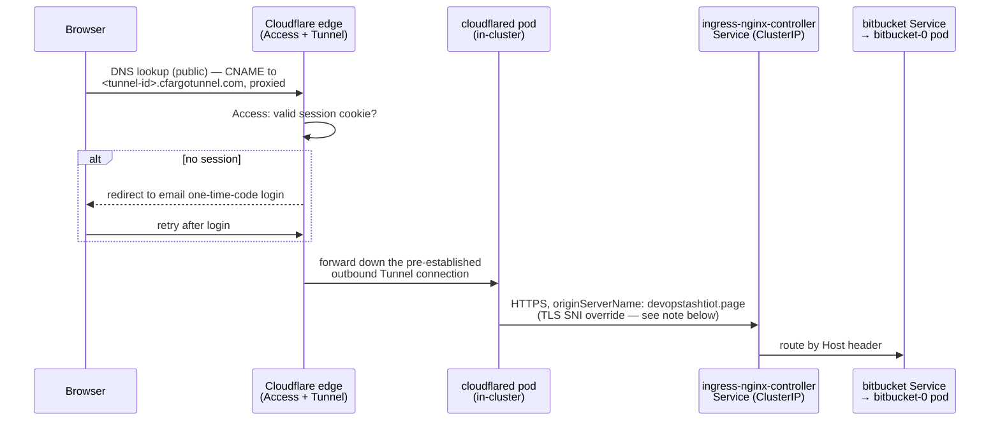
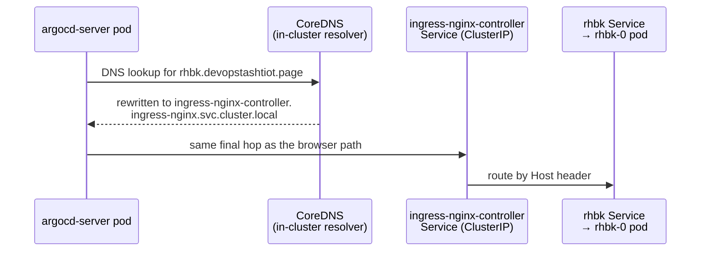
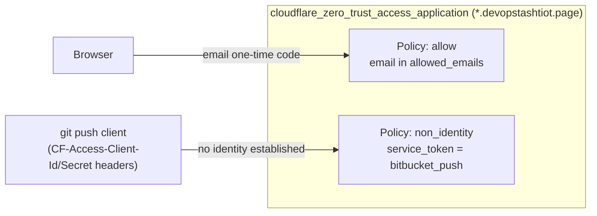

# How Cloudflare Routes Traffic Into the Cluster

`*.devopstashtiot.page` has no inbound-facing LoadBalancer, public IP, or
open firewall port anywhere in this platform. A browser reaching a devtool
and an in-cluster caller reaching the exact same hostname take genuinely
different paths, converging only at `ingress-nginx-controller`.

## A browser hitting `https://bitbucket.devopstashtiot.page`

**Why `originServerName` is set explicitly**: `cloudflared` connects to
ingress-nginx over *real* HTTPS (ingress-nginx presents a Cloudflare Origin
Certificate on :443), not plain HTTP — plain HTTP was tried first and was
the root cause of every devtool computing the wrong
`X-Forwarded-Port`/`X-Forwarded-Proto` (nginx's `$scheme`/`$server_port`
reflect the actual connection, which was always `http`/`80` regardless of
what scheme the browser used at the edge; RHBK/Keycloak and Bitbucket both
built `:80` redirect URLs because of this). But `cloudflared` connects to
the Service by its cluster-DNS name
(`ingress-nginx-controller.ingress-nginx.svc.cluster.local`), which the
Origin Certificate's SAN doesn't cover — the cert only covers
`*.devopstashtiot.page`/`devopstashtiot.page`. `originServerName` overrides
only what's used for TLS validation (the SNI/hostname the cert is checked
against), not where the connection actually goes — so the connection still
opens to the cluster-DNS name, but Cloudflare validates the certificate as
if it had connected to `devopstashtiot.page`.

## An in-cluster caller hitting the same hostname

Example: `argocd-server`'s own OIDC discovery call to
`rhbk.devopstashtiot.page` during login.

No Cloudflare edge, no tunnel, no Access check — the DNS answer is
substituted before the request ever leaves the cluster's own network. Both
paths converge on the same `ingress-nginx-controller` Service; only how a
caller *reaches* that Service differs.

**Why this rewrite has to exist.** Without it, an in-cluster caller's DNS
lookup for `rhbk.devopstashtiot.page` would resolve the normal, public
way — straight to Cloudflare's edge, exactly like a browser's would. The
request would still technically succeed in reaching RHBK (Cloudflare would
forward it right back into the cluster via the tunnel), but the *TLS
certificate chain* would be wrong for that caller: RHBK's own OIDC client
is configured to trust only the internal Origin CA (a private CA used for
east-west/in-cluster TLS), not whatever public CA actually terminates
Cloudflare's edge-facing certificate. The handshake itself works fine; the
caller just doesn't trust the chain, and the call fails with a
certificate-verification error. Routing in-cluster callers directly to the
ClusterIP sidesteps the problem entirely — no public cert, no trust
mismatch.

The rewrite list currently covers: `bitbucket`, `confluence`, `jira`,
`sonarqube`, `artifactory`, `harbor`, `rhbk`, and `woodpecker`
(`*.devopstashtiot.page`), plus a dedicated pair of rules for
`argocd.devopstashtiot.page` and any `*.argocd.devopstashtiot.page`
subdomain (routed to `argocd-server` directly rather than through
ingress-nginx, since no Ingress rule exists for arbitrary ArgoCD
subdomains).

**How the rewrite is actually applied**: injected via the `coredns` EKS
addon's own `configuration_values.corefile` field, not a direct ConfigMap
edit — this is the addon's own supported configuration input, so it
survives addon upgrades/reconciliation and needs no separate restart step.

## Cloudflare Access

Every hostname under `*.devopstashtiot.page` sits behind Cloudflare Access
with a single policy: only a fixed allowlist of email addresses can
authenticate, via a one-time code sent by email (no separate credential to
manage). This is enforced entirely at Cloudflare's edge, before a request
ever reaches the tunnel — the cluster itself has no idea Access exists.

## Prerequisite Cloudflare setup — what has to exist before any of this works

Only two things are genuinely manual, one-time, human-driven steps that
nothing in this repo can create:

1. **Domain on Cloudflare** — the zone's nameservers must already point at
   Cloudflare before anything else here works. (The `cloudflare_zone`
   resource itself is Terraform-managed — see below — but Cloudflare won't
   activate a zone until the registrar's nameservers are pointed at it, and
   that handoff happens outside Terraform.)
2. **A Cloudflare Tunnel** — created once via `cloudflared tunnel create
   <name>` from an authenticated `cloudflared` CLI. This generates a
   tunnel ID and a credentials JSON file. That file's contents go into SSM
   at `/devops/prerequisite/cloudflare/tunnel-credentials` — the in-cluster
   `cloudflared` Deployment reads it from there via an `ExternalSecret`, it
   never touches a local credentials file. `terraform/modules/cloudflare`
   only looks the tunnel up read-only (`data "cloudflare_zero_trust_tunnel_
   cloudflared"`) — the classic tunnel secret is generated client-side by
   the CLI and never round-trips through Cloudflare's API, so a managed
   `resource` here would leave that field unset in state and force a
   destroy+recreate on the next apply.

Everything else that used to be a manual step is now owned by the
`cloudflare` Terraform module (`terraform/modules/cloudflare`, applied from
`terraform/live/devtools/cloudflare`) as a real managed `resource`, not a
one-off dashboard/curl action:

- **DNS records per subdomain** — `cloudflare_dns_record.this`, one per
  entry in that unit's `dns_records` map — a `CNAME` per hostname (or
  wildcard) pointing at `<tunnel-id>.cfargotunnel.com`, proxied
  (orange-cloud) so Cloudflare's edge actually terminates the connection
  instead of routing straight to an IP. Adding a new subdomain is a map
  entry + `terragrunt apply`, not a curl call.
- **Cloudflare Access (Zero Trust)** — `cloudflare_zero_trust_access_
  identity_provider.onetimepin` (the one-time-email-code IDP) plus
  `cloudflare_zero_trust_access_application.this` covering
  `*.devopstashtiot.page`, with an inline `allow` policy built from the
  unit's `allowed_emails` list. The Application's `allowed_idps` field
  **must** explicitly reference that IDP resource — leaving it unset makes
  Access silently fall back to its own default (account-members-only) IDP,
  which blocks every allowlisted email with no trace in the Access logs,
  since the fallback happens before the email policy is ever evaluated.
- **Origin CA certificate** — also fully Terraform-managed:
  `tls_private_key` generates the RSA key, `tls_cert_request` builds the
  CSR from it, and `cloudflare_origin_ca_certificate` submits that CSR to
  Cloudflare's Origin CA API. The private key never leaves Terraform
  state/SSM — only the derived CSR is ever sent to Cloudflare. Both cert
  and key are published to SSM (`origin_cert_crt_ssm_parameter` /
  `origin_cert_key_ssm_parameter`) and mounted into `ingress-nginx` as a
  TLS secret via `ExternalSecret`, letting `cloudflared` connect to
  `ingress-nginx` over real HTTPS instead of plain HTTP. Unlike the tunnel
  secret, nothing here needs to survive from a prior cert — Cloudflare's
  edge trusts any valid Origin CA cert whose hostnames match, so a fresh
  key+CSR on every rotation is a safe, non-disruptive replace, not a
  destroy/recreate hazard.

Since none of the three bullets above require a human to run `cloudflared`
or hit the dashboard anymore, only the domain/zone handoff and the tunnel
creation remain true prerequisites — everything else is just
`terragrunt apply`.

## Cloudflare Access service tokens for non-interactive access

A `git push` (or any other non-browser client) can't complete Access's
email-one-time-code flow — there's no browser to redirect. Bitbucket push
access from outside the cluster (see the parent `CLAUDE.md`'s Cloudflare
section for the client-side usage) solves this with a **service token**,
`cloudflare_zero_trust_access_service_token.bitbucket_push`, which is
presented as `CF-Access-Client-Id`/`CF-Access-Client-Secret` headers
instead of a session cookie. Cloudflare only returns the `client_secret`
once, at creation, so it's published to SSM immediately
(`bitbucket_push_service_token_client_id_ssm_parameter` /
`..._client_secret_ssm_parameter`) rather than left recoverable only from
Terraform state.

The token is authorized by a **second, independent policy** on the same
shared Access Application described above — Access grants a request if
*any* policy on the app matches, so this doesn't weaken the email-OTP
policy at all; it just adds a second, non-interactive way in:

**Its blast radius is domain-wide, not Bitbucket-specific** — the
`non_identity` policy sits on the same wildcard Access Application whose
`domain` is the bare `*.devopstashtiot.page`, so this token bypasses the
email-OTP wall for *every* hostname on the platform (Jira, ArgoCD, RHBK,
...), not just Bitbucket. Bitbucket push is its current consumer, not the
limit of what it can reach — its SSM parameter and dashboard naming are
deliberately not scoped to "bitbucket" for exactly this reason (see the
`wildcard-access-otp-bypass` naming in `terraform/modules/cloudflare`).
Anyone adding a second consumer of this same token, or a new
`non_identity` policy of their own, should treat that as expanding access
to the whole domain, not to one app.
