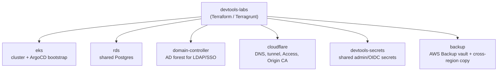

# Architecture Overview

What actually exists in AWS to bring the devtools platform up, and how the
pieces fit together. This is the resource map — for the Cloudflare-specific
request path, see [Cloudflare/CoreDNS routing](architecture.md); for the
apply sequence and prerequisites, see
[Bootstrap from scratch](bootstrap.md).

## The six things Terraform creates

Each is an independent `terragrunt` unit under `terraform/live/devtools` —
no dependency graph between them (see `devtools-labs/CLAUDE.md` → "Six
independent units").

No arrow runs between the six boxes themselves — each is an independent
Terragrunt unit with no `dependency` block on any other (see
`devtools-labs/CLAUDE.md` → "Six independent units"); `terragrunt run-all
apply` runs all six in parallel.

### `eks` — the cluster itself (the slow one, does the real bootstrap)

- A multi-node, multi-AZ **EKS cluster** (`terraform-aws-modules/eks/aws`),
  in the existing `spokeSubnet1`/`spokeSubnet2` pair — no new VPC, subnet,
  NAT Gateway, or Elastic IP (creating any of those is hard-denied by this
  account's SCPs, not just a cost choice — see
  [SCP Limitations](https://devops-tashtiot.github.io/docs/aws/scp-limitations/)).
  Egress reuses a pre-existing shared VPC endpoint.
- Two **Managed Node Groups**: `devtools` (general-purpose, spans both
  AZs, `m6i.xlarge`/`2xlarge`/`4xlarge`) and `devtools-large` (a dedicated
  lane sized for Confluence's 4-core CPU request, which the primary
  group's smallest instance type can never satisfy). Both IAM roles carry
  `AmazonSSMManagedInstanceCore` — any node is reachable via SSM Session
  Manager, no SSH/bastion/key pair.
- **Storage**: `gp3` (EBS CSI, `reclaimPolicy: Delete`, node-local volumes
  — each devtool's `localHome`) and `efs-sc` (EFS CSI,
  `reclaimPolicy: Retain`, `ReadWriteMany` — Bitbucket/Jira/Confluence's
  `sharedHome`, matching Atlassian's own Data Center `SHARED_STORAGE`
  pattern). This module also provisions the EFS filesystem itself.
- **IRSA** (not node-wide IMDS credentials) for `external-secrets`,
  `aws-ebs-csi-driver`, `aws-efs-csi-driver`.
- Installs **ArgoCD** via Helm and registers two `ApplicationSet`
  app-of-apps — `clusters-applicationset` (cluster-infra: ingress-nginx,
  cloudflared, external-secrets-operator, rhbk) first, blocking until
  Synced+Healthy, then `devtools-applicationset` (Jira, Bitbucket,
  Confluence, Artifactory, ArgoCD, Xray, Woodpecker, Harbor, ...). From
  that point on, **ArgoCD owns everything in the cluster** — this
  Terraform module never touches an individual devtool or cluster-infra
  tool again.

### `rds` — the shared database

One PostgreSQL instance (`db.t3.small`, autoscaling storage) that most
devtools connect to as external storage, each provisioning its own
database/role via an init container. Master credentials are published to
SSM for those init containers to read.

### `domain-controller` — the source of truth for every SSO user/group

A Windows Server 2022 EC2 instance (not free-tier, ~$15/mo), promoted to
an Active Directory forest, for LDAP directory integration against
Jira/Bitbucket/Confluence. This AD forest is the **source of truth for
every user and group in the platform's SSO** — not a standalone testing
fixture, and not itself the identity provider users authenticate against
(that's RHBK, via OIDC), but where every account and group RHBK federates
actually comes from. Publishes admin/LDAP-bind credentials to SSM.

### `cloudflare` — DNS, tunnel routing, Access, and the Origin CA

The Cloudflare zone, per-subdomain DNS records, and the Access policy
protecting `*.devopstashtiot.page`. Also manages the Origin CA
certificate every devtool trusts for in-cluster TLS. See
[Cloudflare/CoreDNS routing](architecture.md) for how a request actually
flows through this, and
[Cloudflare limitations & gotchas](cloudflare-limitations.md) for what's
constrained.

### `devtools-secrets` — platform-wide values not tied to one resource

The shared initial admin password every devtool uses, and the shared RHBK
OIDC client secret every devtool federates SSO through.

### `backup` — the actual disaster-recovery layer

An AWS Backup vault + daily plan covering the RDS instance (by ARN) and
anything tagged `BackupManaged=true` (the EFS shared-home filesystem
today), with a cross-region copy action landing a second copy in
`us-east-1` — independent of whatever caused an incident in the primary
region.

## Pre-deployment actions — what a human sets up before any of this can run

Two categories of manual setup have to exist before the first `terragrunt apply`, neither of
which Terraform can create for you:

1. **Prerequisite SSM parameters** — a handful of SSM Parameter Store values Terraform reads as
   data sources rather than generating itself: the shared admin/DB password, each Atlassian
   product's license key, and the Cloudflare tunnel credentials. See the
   [SSM Parameter Reference](ssm-parameters.md) for the complete list across every category
   (prerequisite, terraform-created, postdeploy), or
   [Bootstrap from scratch → Prerequisite](bootstrap.md#2-prerequisite-ssm-parameters-you-set-by-hand)
   for exactly how to set each one.
2. **Cloudflare setup** — a real, active Cloudflare zone, a Tunnel, and an Access Application all
   have to exist first; none of this is Terraform-managed (Route53 is blocked wholesale in this
   AWS account regardless — see [SCP Limitations](https://devops-tashtiot.github.io/docs/aws/scp-limitations/)
   — so DNS/domain setup was never going to come from the AWS side). Done once, by hand, before
   the first apply:
   1. **Domain on Cloudflare** — zone active, nameservers pointed at Cloudflare.
   2. **A Cloudflare Tunnel** — `cloudflared tunnel create <name>` from an authenticated CLI;
      the resulting credentials JSON is published to SSM at
      `/devops/prerequisite/cloudflare/tunnel-credentials`, which the in-cluster `cloudflared`
      Deployment reads via an `ExternalSecret` (it never touches a local credentials file).
   3. **DNS records per subdomain** — a `CNAME` per hostname (or a wildcard) pointing at
      `<tunnel-id>.cfargotunnel.com`, proxied (orange-cloud).
   4. **Cloudflare Access (Zero Trust)** — a one-time-email-code Identity Provider plus an Access
      Application covering `*.devopstashtiot.page` with an email-allowlist policy. The
      Application's `allowed_idps` **must** explicitly reference that IDP, or Access silently
      falls back to its default (account-members-only) IDP and blocks every allowlisted email
      with no trace in the logs.
   5. **Origin CA certificate** — issued via Cloudflare's own Origin CA API (not a
      publicly-trusted CA); the cert and key are published to SSM and mounted into
      `ingress-nginx` as a TLS secret so `cloudflared` can reach it over real HTTPS.

   See [Cloudflare/CoreDNS routing](architecture.md) (its "Prerequisite Cloudflare setup"
   section) for the full detail behind each step, and
   [Cloudflare limitations & gotchas](cloudflare-limitations.md) for what's constrained
   afterward (session length, service-token blast radius, Origin CA trust, etc).

After the cluster is up, a third category (`postdeploy`) covers per-devtool manual steps like API
tokens and OAuth client secrets — see [Post-deployment setup](post-devtools-implementation/jira/README.md)
and the same [SSM Parameter Reference](ssm-parameters.md) for those.

## What's NOT Terraform's job

Every cluster-infra tool and every devtool — their Helm charts, their
per-environment config, their versions — lives in four sibling repos
(`clusters-provision`/`clusters-definition`,
`devtools-provision`/`devtools-definition`) and is deployed and kept in
sync continuously by ArgoCD, not by anything in this repo. `devtools-labs`
creates the cluster and the handful of AWS-level resources above; it never
runs Helm or `kubectl apply` against an individual tool.
